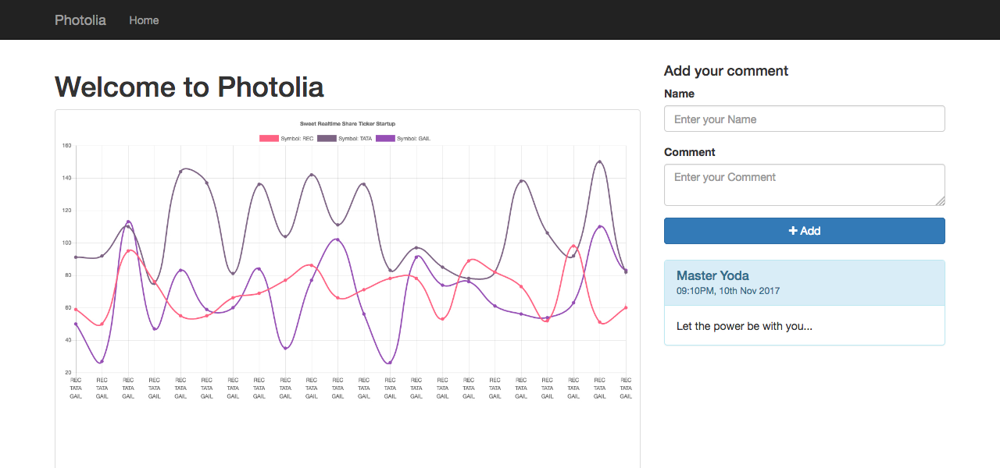

# Photolia


A simple photo gallery with a rich feature set like comments, logs, minimalistic design, pretty URLs, and much more. It uses various Object Oriented Concepts of PHP. Recently added an installation script to simplify the whole process.

## Getting Started

These instructions will get you a copy of the project up and running on your local machine for development and testing purposes. See deployment for notes on how to deploy the project on a live system.

You need to have a working LAMP Installation. 

1. Create a new Host(Local Domain Name)

Add an entry to the hosts file.

`photolia.dev 127.0.0.1`

2. Add a Virtual Host

```
<VirtualHost *:80>
    DocumentRoot "/Library/WebServer/Documents/photolia/public"
    DirectoryIndex index.php index.html
    <Directory "/Library/WebServer/Documents/photolia/public>
      Options +Indexes +FollowSymlinks +MultiViews
      AllowOverride All
      Require all granted
    </Directory>
    ServerName photolia.dev
    ServerAlias www.photolia.dev
</VirtualHost>
```

3. Enable Rewrite Module and Restart Web Server

```
$>sudo a2enmod rewrite
$>sudo service apache2 restart
```

4. Clone this Repository in your Web Root

`git clone https://github.com/shubhamoy/photolia.git`

3. Create an Empty Database

`$> echo "create database `photolia`" | mysql -u username -p`

4. Open your Browser
`http://photolia.dev`

5. It shall present the installation UI.

## Need Help? Suggestions?

Send me a tweet [@shubhamoy](https://twitter.com/shubhamoy)